# textrack

MES para plantas de confección: de la orden de producción al bulto y a la prenda, con tickets QR firmados, app Android que escanea sin conexión, pago a destajo que respeta el Código del Trabajo del Ecuador y OEE en vivo.


     

**Demo en vivo:** se publica con el despliegue gratuito descrito en [Despliegue](#despliegue-gratis) (Vercel + Render + Neon). Mientras tanto, `docker compose up --build` levanta exactamente la misma demo en local.
**Usuario de prueba (solo lectura):** `visor@textrack.demo` / `VisitaTextrack2026` · **APK:** en *GitHub Releases* al publicar el tag `v1.0.0`.


## Problema que resuelve
En una planta de confección cada prenda pasa por 10–15 operaciones de costura. El pago suele ser **a destajo** (por pieza), la producción se controla con papeles que se pierden o se duplican y nadie sabe, en el momento, qué operación frena la línea. textrack registra cada paso con un ticket QR por **bulto × operación**: la operaria lo escanea desde una tablet (aunque no haya Wi-Fi), el servidor impide contarlo dos veces y con esas lecturas calcula el destajo del día con el piso del SBU 2026, la eficiencia de cada operaria, el OEE de cada módulo (ISO 22400-2) y la trazabilidad rollo → bulto → prenda.

## Funcionalidades
- **Orden → corte → bultos → tickets**: la orden define tallas × colores; el corte usa solo rollos aprobados, un bulto sale de un único rollo (mismo lote de teñido) y se genera un PDF A4 imprimible con un QR por bulto y operación.
- **Tickets anti-falsificación**: cada QR lleva una firma **HMAC-SHA-256**; si alguien fotocopia un ticket cambiándole la cantidad o el bulto, el servidor lo rechaza y lo registra en el tablero.
- **App Android offline-first** (Kotlin, Compose, CameraX, ML Kit, Room, WorkManager): escanea con el modelo de ML Kit empaquetado (sin Internet), guarda en Room y sincroniza por lotes cuando vuelve la red.
- **Idempotencia de extremo a extremo**: un ticket no se registra dos veces y reenviar un lote offline no duplica lecturas (restricciones únicas en PostgreSQL + `INSERT … ON CONFLICT`), probado con 12 hilos concurrentes.
- **Destajo diario y semanal**: piezas × tarifa vigente, recargos nocturno (+25 %), suplementario (+50 %/+100 %) y de fin de semana (+100 %), **alerta y complemento** cuando el pago ordinario queda bajo el SBU prorrateado y pago del descanso semanal (Art. 53).
- **Tablero en vivo por WebSocket**: disponibilidad, rendimiento, calidad y OEE por módulo; eficiencia (OIT) y pago de cada operaria; paros activos y últimas lecturas.
- **Cuellos de botella por operación**: WIP, capacidad por hora y minutos restantes con la dotación actual; eficiencia de balanceo de la línea.
- **Calidad**: sistema de 4 puntos (ASTM D5430) para rollos y muestreo AQL (ISO 2859-1) con defectos críticos, mayores y menores ligados al bulto y la operación.
- **Trazabilidad** de una prenda (`CT-00001-001-07`) hasta el rollo, el lote de teñido, quién cosió cada operación y los defectos encontrados.

| Tablero | Cuellos de botella | Destajo |
|---|---|---|
| 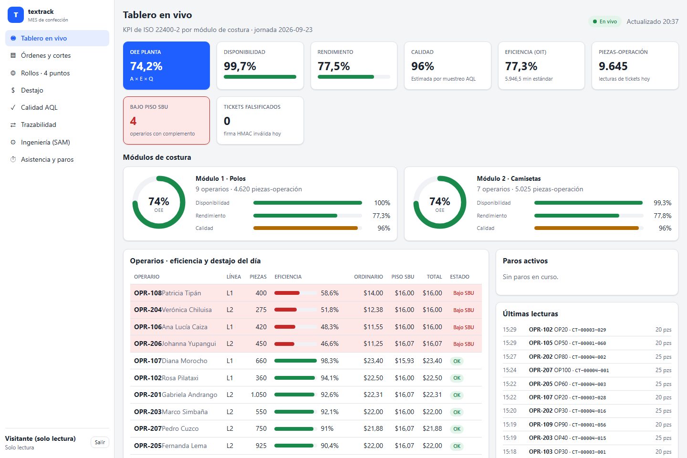 | 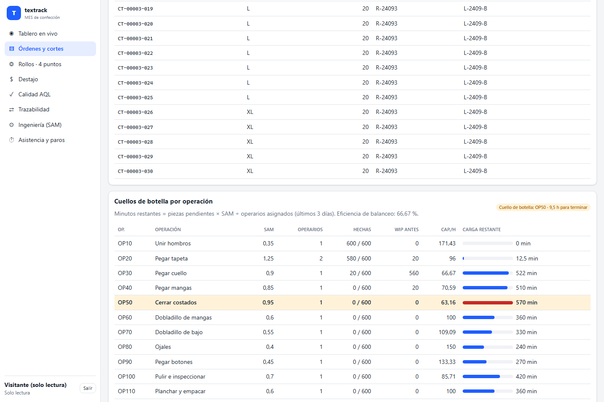 | 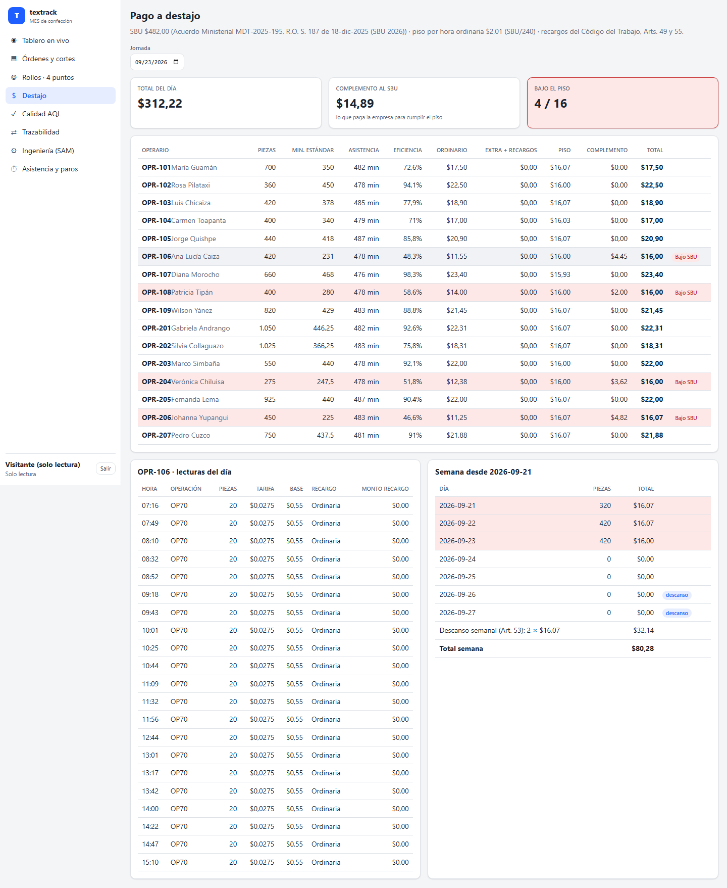 |
| **Trazabilidad** | **Calidad AQL** | **Tickets QR firmados (PDF)** |
| 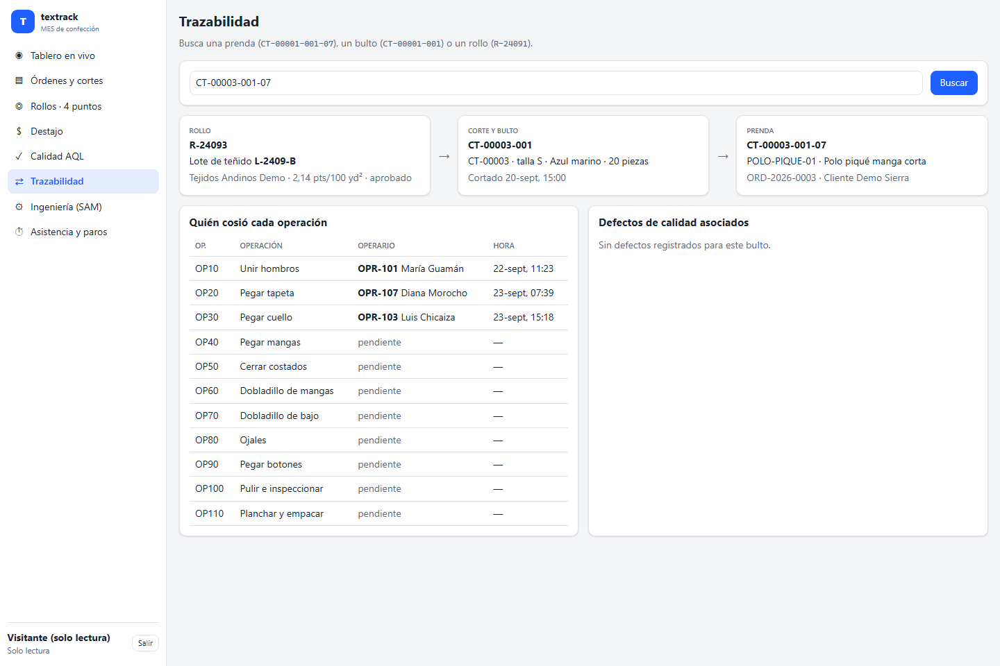 | 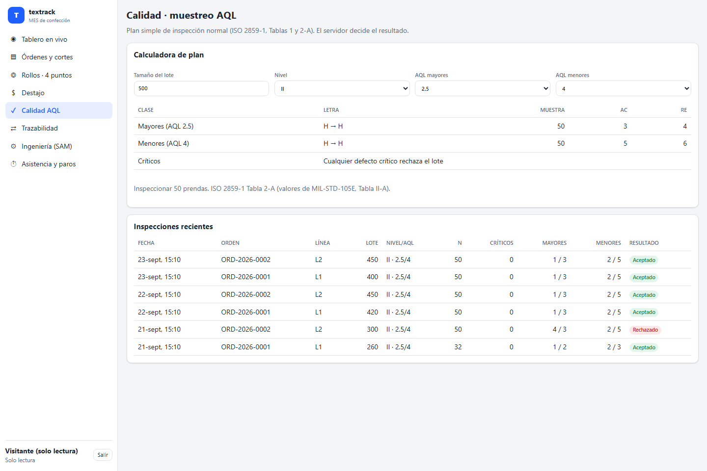 | 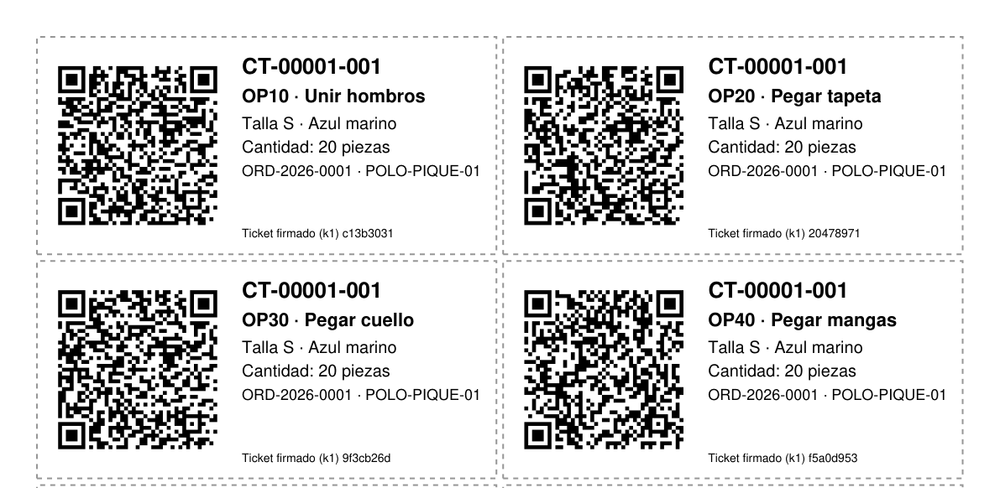 |
| **Órdenes de producción** | **Rollos · sistema de 4 puntos** | **Ingeniería de métodos (SAM y tarifas)** |
| 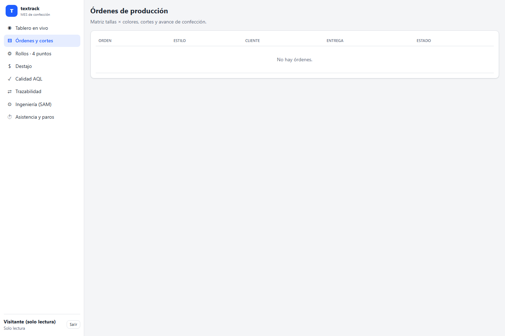 | 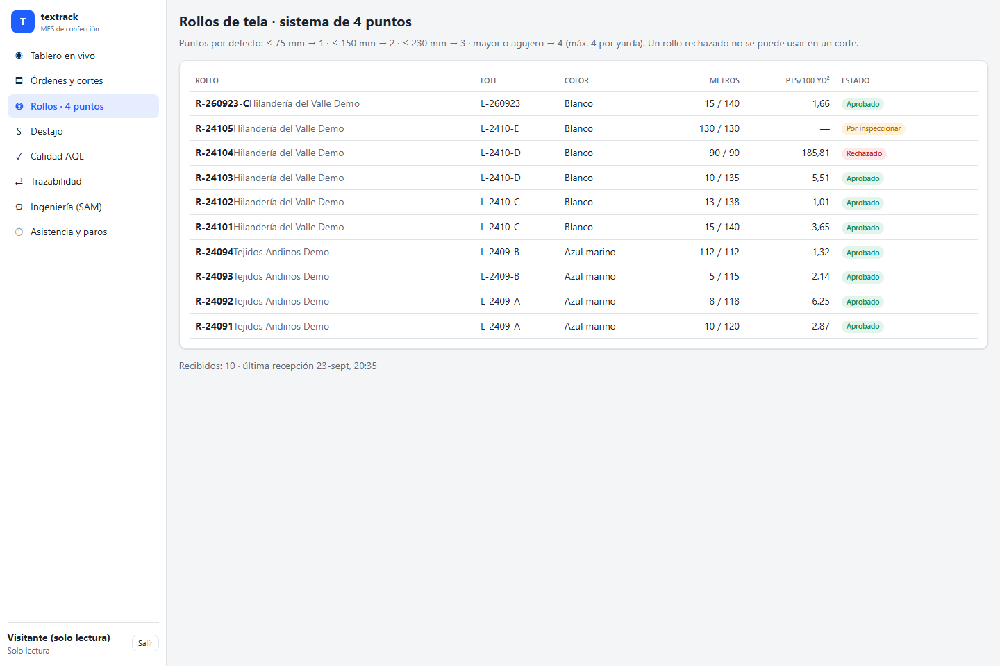 | 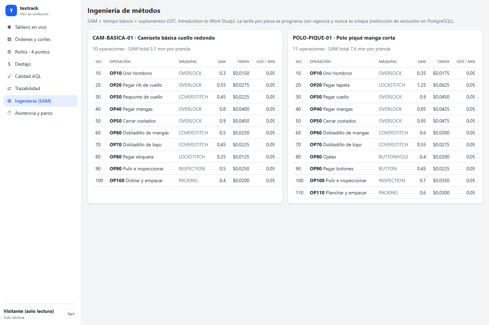 |
| **Tablero en el celular** | **API documentada (Swagger UI)** | **Acceso** |
| 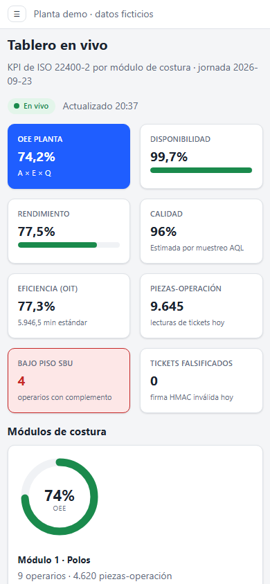 | 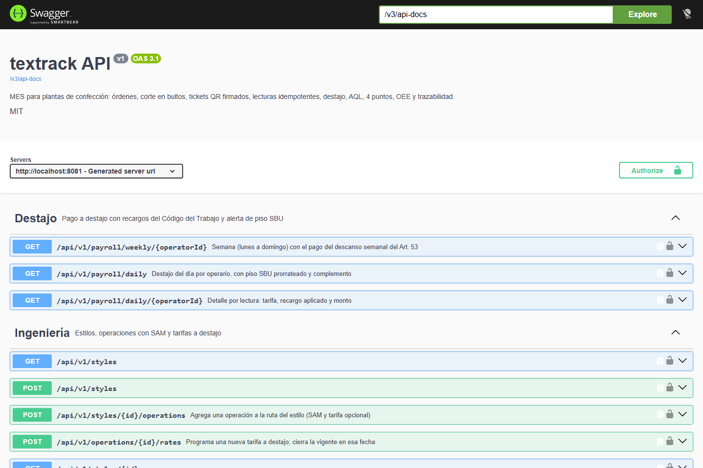 |  |

## Arquitectura
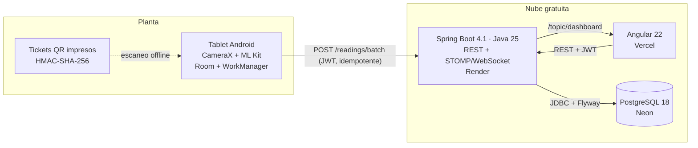
Backend en capas `controller → service → repository` (+ `dto`, `mapper`, `exception`); las reglas de negocio puras (AQL, 4 puntos, destajo, OEE, cuellos de botella, firma de tickets) viven en `service/calc` sin dependencias de Spring, lo que las hace fáciles de probar.

## Stack y por qué
| Capa | Tecnología | Motivo |
|---|---|---|
| Backend | Java 25, Spring Boot 4.1.1, Spring Security (resource server JWT), STOMP | Spring Boot 3.5 terminó su soporte OSS el 30-jun-2026; 4.1 es la línea soportada. STOMP simplifica el tablero en vivo. |
| Acceso a datos | `JdbcClient` + SQL explícito, Flyway | El MES es de agregaciones y de idempotencia en BD (`ON CONFLICT`, restricción de exclusión de tarifas): SQL visible y sin N+1. |
| Base de datos | PostgreSQL 18 | `EXCLUDE USING gist` para que dos tarifas no se solapen, índices únicos para la idempotencia. |
| Frontend | Angular 22 (standalone, signals, zoneless), `@stomp/stompjs` | Sin librería de gráficos: indicadores en SVG propio; bundle inicial de ~78 kB. |
| Android | Kotlin, Jetpack Compose, CameraX, ML Kit (modelo empaquetado), Room, WorkManager, Retrofit | Patrón offline-first recomendado por Android: la base local es la fuente de verdad. |
| PDF y QR | PDFBox 3 + ZXing | QR dibujado como vectores: nítido a cualquier escala de impresión. |
| Pruebas | JUnit 6, AssertJ, Mockito, Testcontainers, Vitest, Playwright | Tests de integración contra PostgreSQL real y e2e contra el stack Docker. |
| DevOps | Docker multi-stage, docker compose, GitHub Actions, gitleaks, Dependabot | Imágenes con versión fija y usuario no root; CI con acciones fijadas por SHA. |

## Modelo de datos
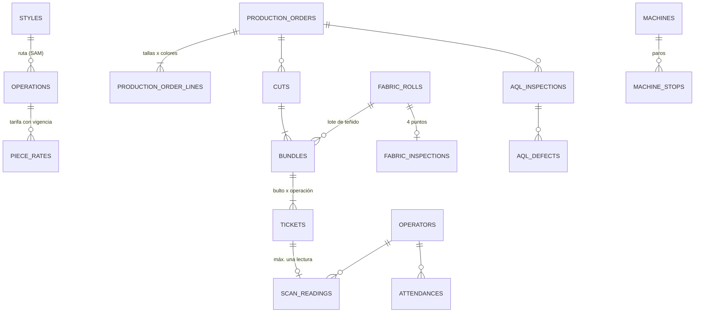
Detalle de tablas, restricciones y la fuente de cada regla en [docs/modelo-datos.md](docs/modelo-datos.md), derivado de [docs/investigacion.md](docs/investigacion.md).

## Ejecutar en local
**Con Docker** (web en http://localhost:8088, API en http://localhost:8081):
```bash
cp .env.example .env        # completa POSTGRES_PASSWORD, JWT_SECRET, TICKET_HMAC_SECRET, SEED_ADMIN_PASSWORD y DEMO_VIEWER_PASSWORD
docker compose up --build   # crea la planta demo ficticia y simula tres jornadas de lecturas
```
**Sin Docker**: PostgreSQL 18 local, luego
```bash
set -a && . ./.env && set +a          # exporta las variables (DB_URL, DB_USER, DB_PASSWORD, JWT_SECRET, ...)
cd backend && ./mvnw spring-boot:run
cd frontend && npm ci && npm start     # http://localhost:4300, proxy a la API en :8081
```
**App Android**: `cd android && ./gradlew assembleDebug` (JDK 17 y Android SDK 37). En el emulador la API es `http://10.0.2.2:8081/`; para un dispositivo real compila con `-PtextrackApiUrl=https://<tu-api>/`. Usuario de la tablet: `tablet@textrack.demo` con `SEED_ADMIN_PASSWORD`.

## Variables de entorno
| Variable | Descripción | Obligatoria |
|---|---|---|
| `DB_URL`, `DB_USER`, `DB_PASSWORD` | Conexión JDBC a PostgreSQL (en compose se arman desde `POSTGRES_*`) | Sí |
| `JWT_SECRET` | Secreto HS256 del JWT (≥ 32 caracteres aleatorios) | Sí |
| `TICKET_HMAC_SECRET` | Clave HMAC-SHA-256 de los tickets QR (≥ 32 caracteres) | Sí |
| `CORS_ALLOWED_ORIGINS` | Orígenes permitidos para REST y WebSocket, separados por coma | Sí |
| `SEED_ADMIN_PASSWORD` | Contraseña de los usuarios internos de la demo (perfil `demo`) | Solo demo |
| `DEMO_VIEWER_PASSWORD` | Contraseña pública del usuario de solo lectura | Solo demo |
| `SPRING_PROFILES_ACTIVE` | `demo` crea datos ficticios y el simulador de lecturas | No |
| `PORT`, `DB_POOL_SIZE`, `APP_FABRIC_MAX_POINTS` | Puerto HTTP, tamaño del pool, umbral de 4 puntos (defecto 40) | No |

Si falta un secreto la API no arranca (no hay valores por defecto).

## API
Swagger UI: `http://localhost:8081/swagger-ui.html` · colección de ejemplos: [docs/api/textrack.http](docs/api/textrack.http)

| Método | Ruta | Descripción |
|---|---|---|
| POST | `/api/v1/auth/login` · `/refresh` · `/logout` | JWT de 15 min y refresh token rotativo (rate limit en login) |
| GET/POST | `/api/v1/production-orders` | Órdenes con matriz tallas × colores |
| POST | `/api/v1/production-orders/{id}/cuts` | Corte → bultos → tickets firmados |
| GET | `/api/v1/cuts/{id}/tickets.pdf` | PDF imprimible de tickets QR |
| POST | `/api/v1/fabric-rolls/{id}/inspection` | Sistema de 4 puntos (aprueba o rechaza el rollo) |
| POST | `/api/v1/readings` · `/readings/batch` | Lecturas idempotentes (201 nueva, 200 duplicada, 409 ya escaneado, 422 inválido o falsificado) |
| GET | `/api/v1/payroll/daily` · `/daily/{operatorId}` · `/weekly/{operatorId}` | Destajo con recargos, piso SBU y descanso semanal |
| GET/POST | `/api/v1/quality/aql-plan` · `/aql-inspections` | Plan AQL e inspección de lotes |
| GET | `/api/v1/dashboard` + WS `/ws` → `/topic/dashboard` | KPI de ISO 22400-2 en vivo |
| GET | `/api/v1/reports/bottlenecks/{orderId}` | Cuellos de botella por operación |
| GET | `/api/v1/traceability/garments/{serial}` · `/bundles/{code}` · `/rolls/{code}` | Trazabilidad rollo → bulto → prenda |

## Tests y cobertura
```bash
cd backend && ./mvnw verify       # 138 tests: unitarios + integración con Testcontainers (PostgreSQL 18) + JaCoCo
cd frontend && npm test           # Vitest (10 tests)
cd frontend && npm run e2e        # Playwright contra el stack (E2E_BASE_URL, E2E_VIEWER_PASSWORD)
cd android && ./gradlew testDebugUnitTest   # 10 tests JVM
```
| Módulo | Cobertura de líneas |
|---|---|
| Reglas puras `service.calc` (AQL, 4 puntos, destajo, OEE, firma, cuellos de botella) | 97,9 % |
| Servicios `service` | 88,3 % |
| Total backend (incluye el generador de datos demo, sin tests) | 73,7 % |

Los criterios de aceptación tienen su test dedicado: `ReadingIdempotencyIT` (ticket repetido, reenvío de lote offline, 12 envíos concurrentes, ticket falsificado) y `PieceRateCalculatorTest` + `PayrollIT` (cálculo de destajo). `TicketPdfServiceTest` rasteriza el PDF, decodifica los QR impresos con ZXing y verifica su firma.

## Despliegue (gratis)
| Servicio | Qué corre | Límites del plan gratuito (verificados sep-2026) |
|---|---|---|
| **Render** (`render.yaml`) | API en Docker, perfil `demo` | Se duerme tras 15 min sin tráfico (el primer acceso tarda ~1 min); 750 h/mes; WebSocket soportado. |
| **Neon** | PostgreSQL 18 | 0,5 GB y 100 CU-h por proyecto; se suspende sin uso. |
| **Vercel** (`frontend/vercel.json`) | Angular estático | Variable `TEXTRACK_API_URL=https://<api>.onrender.com` genera `config.json` en el build. |
| **GitHub Releases** | APK de la tablet | Workflow `release-apk.yml` al crear un tag `v*` (firma con keystore desde secretos). |

Pasos: 1) crear la base en Neon y copiar la cadena JDBC; 2) *New Blueprint* en Render con este repo y completar `DB_*`, `CORS_ALLOWED_ORIGINS` y `DEMO_VIEWER_PASSWORD` (los secretos JWT/HMAC los genera Render); 3) importar `frontend/` en Vercel con `TEXTRACK_API_URL`; 4) definir la variable `TEXTRACK_API_URL` y los secretos del keystore en GitHub y crear el tag `v1.0.0`.

## Seguridad aplicada
- Deny-by-default con roles por ruta (`ADMIN`, `PLANNER`, `SUPERVISOR`, `QUALITY`, `SCANNER`, `VIEWER`); el visor de la demo no puede escribir nada.
- JWT HS256 de 15 min con secreto de entorno; refresh tokens opacos guardados como SHA-256, rotados en cada uso y **revocación total si se reutiliza uno viejo**.
- BCrypt (coste 12), respuesta idéntica y tiempo similar para usuario inexistente, **rate limiting** por IP, por IP + usuario y por cuenta (este último no depende de `X-Forwarded-For`, que el cliente puede falsificar) con Bucket4j.
- Bean Validation en todos los DTO, errores RFC 9457 sin trazas, cuerpos > 1 MB rechazados antes de parsear.
- CORS y orígenes WebSocket explícitos; JWT validado también en el frame STOMP `CONNECT`.
- Cabeceras CSP, HSTS, `X-Frame-Options`, `Referrer-Policy`, `Permissions-Policy` en API y nginx/Vercel; Actuator expone solo `health`.
- SQL solo con parámetros; restricciones de integridad en PostgreSQL.
- Tickets firmados con HMAC-SHA-256 y comparación en tiempo constante; intentos con firma inválida auditados.
- Android: refresh token cifrado con AES-256-GCM (Android Keystore), sin backups en la nube, HTTP en claro solo en debug hacia el emulador.
- Datos 100 % ficticios; de los operarios solo se guarda código, nombre y línea (LOPDP, minimización).
- CI con gitleaks sobre todo el historial, acciones fijadas por SHA y `permissions` mínimos; Dependabot para Maven, npm, Gradle, Docker y Actions.

## Decisiones técnicas
- **Idempotencia en la base de datos, no en la aplicación** → alternativa: comprobar antes de insertar. Con dos tablets sincronizando a la vez, «consultar y luego insertar» tiene carrera; `UNIQUE(ticket_id)` + `UNIQUE(client_reading_id)` con `ON CONFLICT DO NOTHING` la resuelve PostgreSQL de forma atómica.
- **HMAC en lugar de firma asimétrica** → el brief pedía HMAC y la verificación ocurre al sincronizar; la tablet nunca tiene la clave. Siguiente paso natural: Ed25519 para verificar también sin conexión.
- **Piso SBU = SBU/240 por hora ordinaria** → el pago del sábado y domingo se añade aparte (Art. 53), así que el piso de un día de 8 h es SBU/30; las horas suplementarias no cuentan para alcanzarlo.
- **OEE adaptado a confección** → el *work unit* es la estación operaria-máquina: PBT = asistencia − paros planificados; E = minutos estándar ganados / APT; Q estimada por muestreo AQL (supuesto documentado).
- **Tablas AQL modeladas por su estructura diagonal** → en lugar de transcribir 256 celdas, se modela la secuencia 0/1, ↑, ↓, 1/2… y se prueba contra valores publicados de MIL-STD-105E.
- **`JdbcClient` en lugar de JPA** → consultas de agregación y reglas de integridad del lado de PostgreSQL; menos magia que explicar y sin N+1.
- **Simulador de eventos para la demo** → las cifras del tablero (eficiencia ~75 %, OEE ~72 %) salen de simular la línea operación por operación, no de números inventados.

## Roadmap
- [ ] Feriados nacionales del Art. 65 en el cálculo de recargos.
- [ ] Verificación de firma en la tablet con Ed25519 y rotación de claves (`keyId`).
- [ ] Cierre de nómina semanal (congelar el cálculo y exportarlo).
- [ ] Inspección AQL con muestreo doble y reglas de cambio normal/rigurosa/reducida.
- [ ] Test instrumentado de la app Android (Compose UI + Room) en un emulador de CI.

## Fuentes de datos y licencias
- Normativa y referencias: Código del Trabajo del Ecuador; Acuerdo MDT-2025-195 (SBU 2026); OIT *Introduction to Work Study*; ISO 22400-2, ISO 2859-1 y ASTM D5430 (fichas oficiales); MIL-STD-105E (dominio público); Kang et al. 2016 (NIST); Das Gupta et al. 2024 (*Heliyon*, acceso abierto). Detalle, URL y fecha de consulta en [docs/investigacion.md](docs/investigacion.md).
- Datos de la demo: 100 % ficticios, generados por el perfil `demo`.
- Código bajo licencia [MIT](LICENSE).

## Autor
**Diego Francisco Granda Zhingre** · [GitHub](https://github.com/DiegoFranciscoG) · [LinkedIn](https://www.linkedin.com/in/diego-francisco-g-61b793254/) · [Portafolio](https://diegofranciscog.github.io/)
