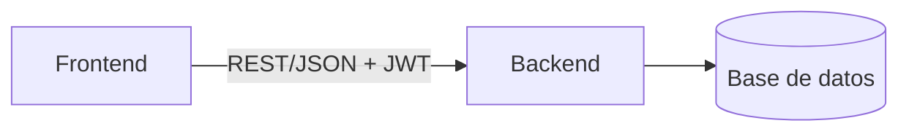

<!-- Plantilla de README del portafolio. Reemplaza TODO lo que está entre < >. Borra este comentario. -->
# <Nombre del proyecto>

<Una frase de valor: qué problema resuelve y para quién.>


  

**Demo:** <URL> · **Usuario de prueba:** `demo@demo.com` / `<contraseña de demo sin privilegios>`


## Problema que resuelve
<2–4 líneas con el contexto real (empresa, proceso, norma) y el dolor que elimina.>

## Funcionalidades
- <Funcionalidad 1>
- <Funcionalidad 2>
- <Funcionalidad 3>

## Arquitectura


## Stack y por qué
| Capa | Tecnología | Motivo |
|---|---|---|
| Backend | <...> | <...> |
| Frontend | <...> | <...> |
| Base de datos | <...> | <...> |
| DevOps | Docker, GitHub Actions | <...> |

## Modelo de datos
Ver [docs/modelo-datos.md](docs/modelo-datos.md) (derivado de las fuentes en [docs/investigacion.md](docs/investigacion.md)).

## Ejecutar en local
```bash
cp .env.example .env        # completa los valores
docker compose up --build   # levanta todo
```
Sin Docker: <pasos>.

## Variables de entorno
| Variable | Descripción | Obligatoria |
|---|---|---|
| `DB_PASSWORD` | Contraseña de la base de datos | Sí |
| `JWT_SECRET` | Secreto de firma JWT (≥ 32 bytes aleatorios) | Sí |

## API
Swagger: `http://localhost:8080/swagger-ui.html`

| Método | Ruta | Descripción |
|---|---|---|
| GET | `/api/<recurso>` | <...> |

## Tests
```bash
./mvnw verify   # unitarios + integración (Testcontainers) + cobertura JaCoCo
```

## Despliegue (gratis)
<Servicio → qué corre ahí → límites del plan gratuito.>

## Seguridad aplicada
- Secretos por variables de entorno; escaneo de secretos en CI.
- <Autenticación/autorización, validaciones, rate limiting, etc.>

## Decisiones técnicas
- <Decisión → alternativa descartada → por qué.>

## Roadmap
- [ ] <Siguiente mejora>

## Fuentes de datos y licencias
- <Fuente> — <licencia> — <enlace>

## Autor
**Diego Francisco Granda Zhingre** · [GitHub](https://github.com/DiegoFranciscoG) · [LinkedIn](<url>)
