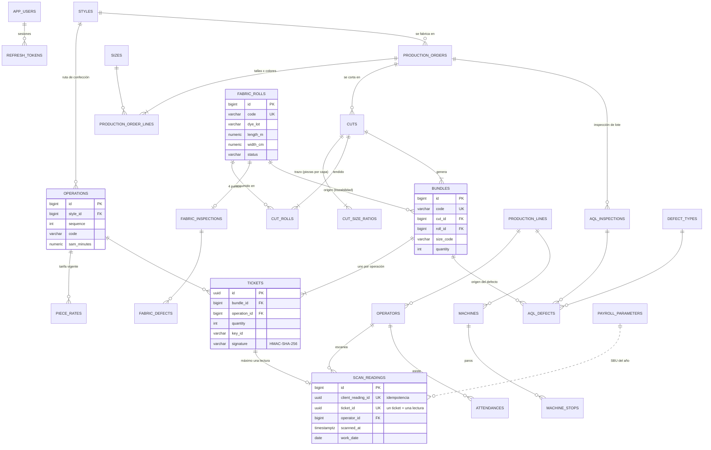

# Modelo de datos

Derivado de [investigacion.md](investigacion.md). La columna **Fuente** remite a la tabla de fuentes (`#n`), a las reglas (`Rn`) o a los supuestos (`Sn`).
Motor: PostgreSQL 18 · Migraciones versionadas con Flyway en `backend/src/main/resources/db/migration`.

Convenciones: nombres en inglés y `snake_case`; claves `bigserial` (salvo `tickets.id`, UUID porque viaja en el QR); dinero en `numeric` (nunca `float`); instantes en `timestamptz` y fecha de negocio (`work_date`) calculada en la zona `America/Guayaquil`.

## Diagrama ER

## Tablas

### Seguridad
| Tabla | Campo | Tipo | Restricción | Regla / fuente |
|---|---|---|---|---|
| app_users | email | varchar(120) | único, no nulo | Login |
| app_users | password_hash | varchar(100) | BCrypt (coste 12) | OWASP #20 |
| app_users | role | varchar(20) | `ADMIN, PLANNER, SUPERVISOR, QUALITY, SCANNER, VIEWER` | Mínimo privilegio (API5, #20) |
| refresh_tokens | token_hash | char(64) | único; se guarda el SHA-256, nunca el token | Rotación en cada uso |
| refresh_tokens | expires_at / revoked_at | timestamptz | caduca en 7 días | Sesión de la app offline |

### Catálogos y parámetros
| Tabla | Campo | Tipo | Restricción | Regla / fuente |
|---|---|---|---|---|
| payroll_parameters | year | int | PK, 2000–2100 | R9 |
| payroll_parameters | sbu | numeric(10,2) | > 0; 2026 = 482,00 | #10 |
| payroll_parameters | legal_reference | varchar(200) | no nulo | Acuerdo MDT-2025-195 (#10) |
| sizes | code | varchar(5) | PK (`XS…3XL`), `sort_order` | Pedido por talla |
| defect_types | code / category / default_severity | varchar | categoría (`SEWING, FABRIC, MEASUREMENT, FINISHING, LABELING, STAIN`), severidad (`CRITICAL, MAJOR, MINOR`) | R5, S8 |

### Ingeniería
| Tabla | Campo | Tipo | Restricción | Regla / fuente |
|---|---|---|---|---|
| styles | code | varchar(30) | único | Estilo = prenda con ruta de operaciones |
| operations | sequence, code | int, varchar(20) | únicos por estilo; sequence > 0 | Ruta de confección |
| operations | machine_type | varchar(30) | catálogo (`LOCKSTITCH, OVERLOCK, COVERSTITCH, BARTACK, BUTTONHOLE, BUTTON, IRON, MANUAL, INSPECTION, PACKING`) | Balanceo de línea |
| operations | sam_minutes | numeric(8,4) | 0 < SAM ≤ 60 | R2 (#2) |
| piece_rates | rate_usd | numeric(10,4) | ≥ 0 | R7 (#9 Art. 16) |
| piece_rates | valid_from / valid_to | date | `valid_to > valid_from`; **EXCLUDE gist**: sin solapes de vigencia por operación | Una sola tarifa válida por día |

### Planta
| Tabla | Campo | Tipo | Restricción | Regla / fuente |
|---|---|---|---|---|
| production_lines | code | varchar(20) | único | *Work unit* del OEE (#3) |
| operators | code, full_name, line_id | varchar, FK | código único; **sin cédula ni contacto** | R13 (#11) |
| machines | code, machine_type, line_id | varchar, FK | código único | Paros por máquina |
| attendances | work_date, check_in, check_out, break_minutes | date, timestamptz, int | único (operario, fecha); `check_out > check_in`; descanso 0–120 min | R3 (minutos reloj), R8 (8 h), R9 |
| machine_stops | reason, planned, started_at, ended_at | varchar, bool, timestamptz | `ended_at > started_at`; `planned` separa PDOT de ADOT | R4 (#4) |

### Producción
| Tabla | Campo | Tipo | Restricción | Regla / fuente |
|---|---|---|---|---|
| production_orders | code, style_id, customer, due_date, status | varchar, FK, date | `PLANNED → CUTTING → IN_PROGRESS → COMPLETED` o `CANCELLED` | OP |
| production_order_lines | size_code, color, quantity | FK, varchar, int | único (OP, talla, color); 0 < cantidad ≤ 100 000 | Matriz tallas × colores |
| fabric_rolls | dye_lot, length_m, width_cm, remaining_m, status | varchar, numeric | `0 ≤ remaining_m ≤ length_m`; estados `RECEIVED, APPROVED, REJECTED, EXHAUSTED` | R1, R6 |
| fabric_inspections | total_points, points_per_100_sq_yd, max_points_allowed, accepted | int, numeric, bool | una por rollo | R6 (#7, #8, S3, S4) |
| fabric_defects | position_m, length_mm, is_hole, points | numeric, int, bool, smallint | 1 ≤ points ≤ 4 | R6 (#8, S5) |
| cuts | code, production_order_id, color, max_bundle_size | varchar, FK, int | 1 ≤ bulto ≤ 100 piezas | Corte |
| cut_size_ratios | size_code, pieces_per_ply | FK, int | > 0 | Trazo del corte |
| cut_rolls | roll_id, plies, meters_used | FK, int, numeric | solo rollos `APPROVED` y del mismo color; `meters_used ≤ remaining_m` | R6, S10 |
| bundles | code, roll_id, size_code, color, quantity, bundle_number | varchar, FK, int | un bulto sale de **un solo rollo**; único (corte, número) | S10, trazabilidad |
| tickets | id (UUID), bundle_id, operation_id, quantity, key_id, signature | uuid, FK, varchar | único (bulto, operación) | R12 (#13) |
| scan_readings | client_reading_id, ticket_id, operator_id, scanned_at, received_at, work_date, device_id, source | uuid, FK, timestamptz, date | **`ticket_id` único** y **`client_reading_id` único** | R11 (#12, #14) |
| rejected_scans | client_reading_id, raw_payload, reason, device_id | uuid, varchar | `client_reading_id` único (reintentos no duplican) | Auditoría anti-falsificación (R12) |

### Calidad
| Tabla | Campo | Tipo | Restricción | Regla / fuente |
|---|---|---|---|---|
| aql_inspections | inspection_level | varchar(4) | `S1, S2, S3, S4, I, II, III` | R5 (#6 Tabla I) |
| aql_inspections | lot_size | int | ≥ 2 | #6 |
| aql_inspections | aql_major, aql_minor | numeric(5,3) | valores preferentes 0,10 … 6,5 | R5 |
| aql_inspections | code_letter, sample_size, major/minor accept/reject | char, int | calculados por el servicio (no los escribe el usuario) | #6 Tabla II-A, S2, S8 |
| aql_inspections | critical/major/minor_found, defective_units, result | int, varchar | `ACCEPTED, REJECTED` | R5, S7 |
| aql_defects | defect_type_code, severity, quantity, bundle_id, operation_id | FK, varchar, int | cantidad > 0 | Retroalimentación a la operación / operario |

## Cálculos (no se guardan: se derivan de las lecturas)

| Cálculo | Fórmula | Fuente |
|---|---|---|
| Pago a destajo del día | `Σ piezas × tarifa(operación, fecha)`, más recargo del 50 % o 100 % según la hora o el día (R8) | #9 Arts. 16 y 55 |
| Piso diario | `SBU(año) / 240 × min(horas ordinarias, 8)` → alerta y complemento si el pago ordinario es menor | #9 Arts. 53, 81 y 82; #10; S1 |
| Descanso semanal | `2 × max(promedio lunes–viernes, SBU/30)` | #9 Art. 53 |
| Eficiencia del operario | `Σ(SAM × piezas) / minutos de asistencia` | #2 |
| OEE por línea | `A = APT/PBT`, `E = Σ(SAM × piezas)/APT`, `Q = 1 − defectuosas/muestra`, `OEE = A·E·Q` | #3, #4, S7 |
| Cuello de botella | por operación: `minutos restantes = piezas pendientes × SAM / operarios asignados` → la operación con más minutos restantes (o sin dotación) es el cuello de botella | #2 (balanceo de línea) |
| Plan AQL | Tabla I + Tabla II-A (flechas ↑/↓) | #6 |
| 4 puntos | `puntos × 36 × 100 / (yd inspeccionadas × ancho in)` | #8 |

## Datos de ejemplo

- Catálogos oficiales (SBU 2026, tallas, tipos de defecto) en migraciones Flyway.
- Datos de demostración **ficticios** (operarios, clientes, órdenes, rollos, lecturas) generados al arrancar con el perfil `demo`; los tickets se firman con la clave del entorno, por eso no van en SQL.
